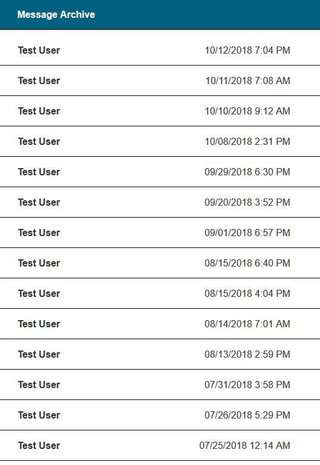
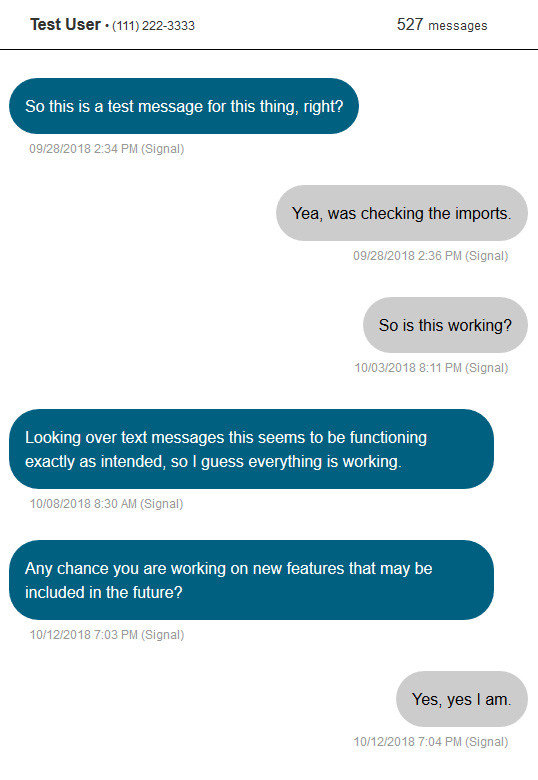

# message-archive
A web-based message archive viewer for Signal and Google Voice.

<table border=0 padding=1>
   <tr>
     <td></td>
     <td></td>
  </tr>
</table>

## Install
The best way to install is to use the docker image from the Docker Hub (https://hub.docker.com/r/nowsci/message-archive/).
```
docker pull nowsci/message-archive
```
With the following docker compose:
```
version: '2.1'

services:

  message-archive:
    image: nowsci/message-archive
    container_name: message-archive
    environment:
      - SIGNAL_PASS=AAAAA BBBBB CCCCC DDDDD EEEEE FFFFF
      - MY_NUMBER=12223334444
    volumes:
      - /etc/localtime:/etc/localtime:ro
      - ./message-archive/data:/data
    ports:
      - 80:80
    restart: always
```
Next, start the container:
```
docker-compose up -d message-archive
```
If you visit the site, you're going to get an error until you run your import. So first, run:
```
docker exec -ti message-archive import
```
This will:
- Set up the folder structure
- Create a blank database
- Secure the site with username `admin` and password `password` via `./message-archive/data/htpasswd`

You will notice a folder exists now called `./message-archive/data/backups/watch`. Place your Signal `.backup` files and Google Takeout `.zip` files there. Then run the import again:
```
docker exec -ti message-archive import
```
Now your messages will display! You can add any files to the `watch` folder and run the import again at any point and it will merge in new messages, ignoring existing ones even if they were in a previous archive file.

## Manual install
While docker is the preferred way to run message-archive, you can run it manually if you prefer. You will need a PHP/Apache setup for the files in `html` and you will need to point the database location in the `php` files to the right file. You will also need:
- Signal-back from https://github.com/xeals/signal-back
- unzip
- python3
- wget

After that, to run imports you can use `message-archive.py`:
```
usage: message-archive.py [-h] [-p SIGNAL_PASS] [-s SIGNAL_BACK] -m MY_NUMBER -d DATA_DIR

Import Signal and Google Voice backups into Sqlite3.

optional arguments:
  -h, --help                                 show this help message and exit
  -p SIGNAL_PASS, --signal-pass SIGNAL_PASS  Password for signal backup
  -s SIGNAL_BACK, --signal-back SIGNAL_BACK  Path to signal-back

required arguments:
  -m MY_NUMBER, --my-number MY_NUMBER        Your phone number. Format: "12223334444"
  -d DATA_DIR, --data-dir DATA_DIR           The data directory
```
